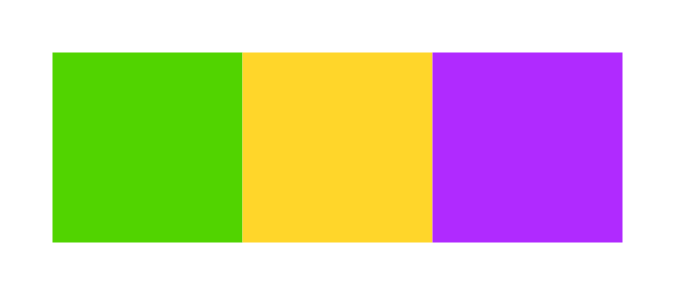

# CSS Layout

Practice layout and positioning with CSS

## Objectives

- Playing with texts
- Understand the box model
- Learn about css positioning
- Get to know flexbox

## Material Review

- text-decoration
- font-weight
- text-transform
- box sizing
- display:
  - block
  - inline
  - inline-block
  - none
- float
  - clear
  - clearfix with pseudo elements
- position:
  - static
  - relative
  - absolute
  - fixed
- z-index
- flex-box
  - purpose
  - orientation
  - positioning
- overflow

## Workshop

Build these simple layouts in HTML and CSS

- Create each in its own, separate directory
- Try to use the most simple selector when selecting an element
- Try to avoid duplicating code
- Use paint, gimp, infraview or something similar to figure out the sizes and colors

### Bookmarks

- https://css-tricks.com/snippets/css/a-guide-to-flexbox/
- http://yoksel.github.io/flex-cheatsheet/

### Flexbox

```CSS
.container {
  display: flex;
  align-items: center;
  justify-content: space-around;
}

.item {
  align-self: flex-end;
}
```

#### Exercise 1.

Reproduce the following 4 layouts with the same HTML structure:
```HTML
<div class="container">
  <div class="item green"></div>
  <div class="item yellow"></div>
  <div class="item purple"></div>
</div>
```

##### Exercise 1.1


- The items should be fixed width and height

##### Exercise 1.2.


- The items should fill all available horizontal space
- The yellow item should be twice as big as the side items

##### Exercise 1.3.


- The items' order should stay the same in the HTML and only change in display

##### Exercise 1.4.


- The container should have a fixed width
- The items should fill all available horizontal space
- The yellow item should be twice as tall as the side items

#### Exercise 2


- The items should have fixed sizes
- The purple item should be centered in the yellow area


#### Exercise 3

Reproduce the following 3 layouts with the same HTML structure:
```HTML
<ul class="container">
  <li class="item"></li>
  <li class="item"></li>
  <li class="item"></li>
  <li class="item"></li>
</ul>
```
- The purple items should have fixed size
- The yellow area should fill all available horizontal space
- The yellow area should have a fixed height

##### Exercise 3.1


##### Exercise 3.2


##### Exercise 3.3


### Layouts

#### Exercise 4


- The layout should be centered on the page.
- The layout should have fixed width.
- When picking the semantically correct element, consider the roles of the boxes:
  - Purple: Header
  - Cyan: Navigation links
  - Yellow: Main Content
  - Green: Sidebar (not main content)

#### Exercise 4.2


- The header should fill available horizontal space
- The header should *stay in view, on top, even after scrolling*
- When picking the semantically correct element, consider the roles of the boxes:
  - Purple: Header
  - Cyan: Navigation links
  - Yellow: Main Content
  - Green: Sidebar (not main content)
  - Gray: Footer

#### Exercise 5


- It should be centered on the page.
- It should have fixed width.
- When picking the semantically correct element, consider the roles of the boxes:
   - Aqua (light blue): Header
   - Orange: Left sidebar (not main content)
   - Red: Main Content
   - Black: Fixed content on the bottom right of the Main content
   - Purple: Right sidebar (not main content)
   - Blue: Footer

#### Exercise 5.2


- It should be wall to wall with fluid width.
- The sidebars should have fixed with.

#### Exercise 6


- The layout should have a fixed *maximum* width
- The green sidebar should have a fixed width
- The yellow main area should fill all available space
- There should be 4 of the red list item squares next to each other but their width can be flexible
- You can use any lorem ipsum generator for texts instead of the lines

#### Exercise 7


- The header should fill available horizontal space
- The header should *stay in view, on top, even after scrolling*
- The rest of the layout should have a fixed *maximum* width
- The green boxes should keep their relative size - 1:1, 2:1:1 per row
- You can use any lorem ipsum generator for texts instead of the lines
